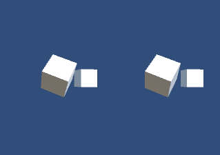

# xeye3d - Cross Eye 3D POC

## Concept

Basically position yourself 10 inch near to the display and cross your eyes. Eventually will result in seeing both pictures in 3D in front of you.  
If it doesn't work try the Magic Eye pictures. If you can't see them, you probably won't see the 3D effect here neither.

Keep in mind, that the size of the render view should resemble the approximate size of your eye's area, e.g. half size of a smart phone.

## License

No license, just fun. Do whatever you desire.